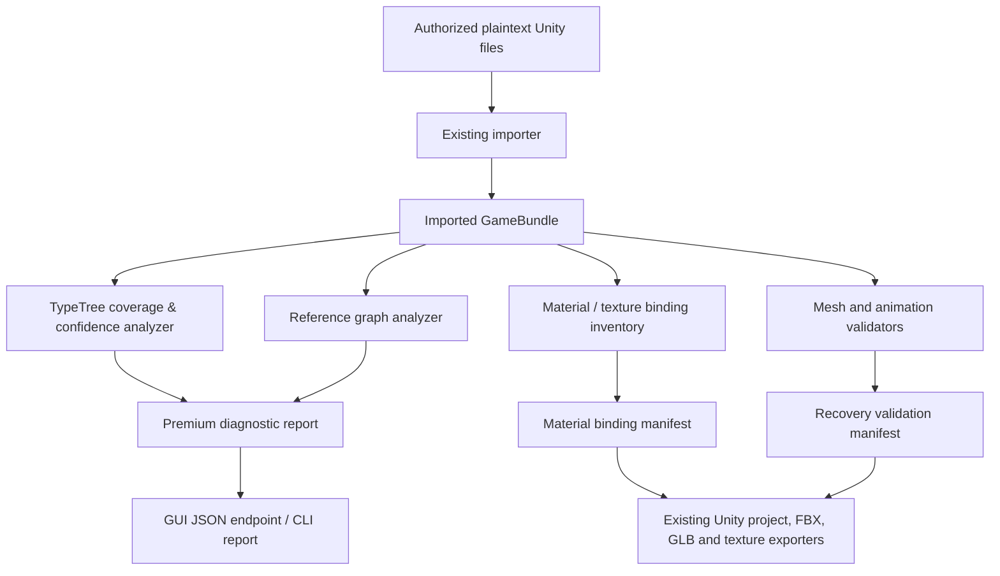

# Advanced Authorized Recovery Architecture

> **Purpose.** This design extends AssetRipper DzGreen Premium only for Unity data that the user is entitled to process and that the standard importer can read. The design classifies uncertainty rather than inventing layouts, missing dependencies, shader source, or decoded content.

## 1. Design constraints

The new work must retain four non-negotiable properties. First, the normal importer remains the only binary ingestion path; no memory inspection, key acquisition, container decryption, or access-control bypass is introduced. Second, every inferred relationship carries a confidence level and evidence. Third, an unknown field layout is emitted as unresolved rather than guessed. Fourth, no output claims a one-to-one restoration unless it passes a fixture-specific comparison.

| Principle | Engineering consequence |
| --- | --- |
| Evidence before inference | A proposed schema records its source: embedded TypeTree, known engine schema, reference metadata, or unresolved. |
| Preserve, do not fabricate | Missing Mesh, Shader, Script, Texture, Audio, or reference stays missing in the report. |
| Deterministic output | Inputs are ordered by canonical path; graphs and reports are stable across repeated runs. |
| Isolated failure | A malformed asset collection is quarantined by the existing importer and cannot turn into a guessed schema for other collections. |
| Fixture-led release | A recovery mode becomes default only after its authorized fixture and regression tests pass. |

## 2. Proposed layered architecture



The importer, asset model, and existing exporters remain the source of truth. New Premium modules are read-only analyzers and configuration profiles around these components. This makes failures inspectable and avoids parallel parsers that can silently diverge.

## 3. TypeTree coverage and confidence architecture

### 3.1 Existing extension point

`AssetRipper.Tools.TypeTreeExtractor` already loads an ordinary file tree through `SchemeReader`, recursively finds `SerializedFile` instances, and emits embedded TypeTrees when `HasTypeTree` is true. The proposed Premium module extends this observation model rather than replacing it.

### 3.2 Output model

Every SerializedFile and serialized type receives one of the following coverage states.

| State | Evidence | Allowed behavior |
| --- | --- | --- |
| `Embedded` | The input contains a readable TypeTree | Read and report normal schema metadata. |
| `KnownEngineSchema` | Class ID and Unity version map to an existing maintained schema | Use the existing generated asset model; report the schema version. |
| `ReferenceType` | A readable reference type provides assembly and full type names | Export known fields only and include reference evidence. |
| `Partial` | Some field or layout evidence is available but not enough to prove a full map | Emit a field coverage diagnostic; do not write unresolved fields. |
| `Unavailable` | No embedded or supported schema evidence exists | Keep the asset unreadable and explain why. |

The distinction is deliberate: a stripped TypeTree does not automatically mean an arbitrary schema can be reconstructed safely. A `KnownEngineSchema` result is a compatibility mapping with auditable evidence, not an asserted recovery of custom fields.

### 3.3 Module boundaries

| Component | Responsibility | Input | Output |
| --- | --- | --- | --- |
| `PremiumTypeTreeCoverageAnalyzer` | Computes coverage for imported collections and types | `GameBundle`, Unity version, serialized metadata | Stable per-file/type coverage records |
| `PremiumSchemaEvidence` | Records why a mapping is valid | Class ID, version range, embedded/reference metadata | Evidence source and confidence |
| `PremiumReferenceGraphAnalyzer` | Traverses existing `FetchDependencies()` results | Imported Unity objects and PPtr values | Missing, resolved, circular, and cross-file edges |
| `PremiumImportDiagnostics` | Aggregates safe observations | Existing bundle plus analyzer reports | JSON and UI-readable report |

### 3.4 Confidence rules

The first implementation should not use heuristic byte scanning to assign fields. It should use deterministic rules:

1. Prefer an embedded TypeTree.
2. Otherwise match only versioned schemas that already exist in the source-generated model.
3. Use `SerializedTypeReference` metadata only to label types and report field availability.
4. When evidence conflicts, mark the record `Partial` and preserve raw export only when supported by the existing exporter.
5. Report unresolved custom `MonoBehaviour` fields as unavailable; never infer offsets from unrelated binaries.

This architecture gives a useful result for stripped but standard Unity data: the user learns exactly which assets are represented by an engine schema and which require a matching fixture or a future supported schema.

### 3.5 Reference graph and project output

The dependency graph should use the existing `IUnityAssetBase.FetchDependencies()` and PPtr resolution mechanisms. Each edge must contain source object identity, field name, target FileID/PathID, resolution result, and whether the target lies in the same collection, another supplied collection, or is absent. Circular references are reported as graph cycles; they are not recursively cloned.

The graph can improve current Unity project diagnostics by separating three user-actionable causes of a missing reference: **not supplied**, **unsupported schema**, and **failed importer collection**. This is more useful than a generic dependency-not-found message.

## 4. Shader and material binding architecture

### 4.1 Scope

The goal is a **readable material binding manifest**, not proprietary bytecode decompilation. Existing GLB export already reads texture properties from a Material and binds conventional main and normal textures. The new module broadens that inventory so the Unity project export and diagnostics can preserve all readable material property bindings and their transforms.

Unity documents that a ShaderLab `Properties` block defines the values stored by Material assets; it includes scalar, vector, color, texture, 2D array, 3D, and cubemap properties. Unity also documents that texture properties have associated `{TextureName}_ST`, `{TextureName}_TexelSize`, and potentially `{TextureName}_HDR` vector properties [1] [2].

### 4.2 Proposed records

| Record | Fields | Purpose |
| --- | --- | --- |
| `PremiumMaterialBinding` | material name/ID, shader name/ID, pipeline hint, binding list | One material inventory record |
| `PremiumTextureBinding` | property name, texture PPtr result, scale, offset, texture dimension, status | Captures every readable texture property |
| `PremiumScalarBinding` | property name, kind, float/int/vector/color value, status | Captures readable numeric properties |
| `PremiumShaderAvailability` | readable properties, source availability state, bytecode presence flag | States what can be exported without decompiling bytecode |

### 4.3 Pipeline hinting

The module may label a material as Built-In, URP-like, HDRP-like, or Custom only when its available shader name and properties support that observation. A label remains a hint, not a reconstruction claim. Any material without readable properties is exported through the existing fallback behavior and marked `NoReadablePropertyInventory`.

### 4.4 Export artifact

For each Unity project export, emit a machine-readable sidecar:

```text
Assets/AssetRipperDzGreen/Diagnostics/MaterialBindings.json
```

It includes existing property names, resolved texture paths, tiling/offset data, unresolved pointers, and shader availability. No generated HLSL, Cg, ShaderLab source, or decompiled proprietary bytecode is produced.

## 5. Mesh, BlendShape, skeleton, and animation milestones

The current model exporter already has a GLB path that binds `IMesh`, renderer materials, node transforms, and resolved SkinnedMeshRenderer bones. The next work is validation-first.

| Milestone | Validator | Acceptance signal | Required authorized fixture |
| --- | --- | --- | --- |
| Vertex layout coverage | Detect positions, normals, tangents, colors, UV channel counts, and index ranges | Every reported channel has a supported source and expected count | Static Mesh with multiple UVs and vertex colors |
| Skeleton integrity | Match bone count, root bone, resolved Transform tree, bind-pose count | No unresolved bone PPtr; bind-pose count matches expectation | Skinned character with at least 20 bones |
| BlendShape integrity | Count channels/frames and validate delta array lengths | Frame names and vertex-delta cardinality are preserved | Facial mesh with at least three BlendShapes |
| Animation binding | Inspect readable clips and controller references | Clip, target path, and transform binding show resolved/unresolved state | Character with idle, walk, and non-looping action |
| FBX/GLB round-trip | Import exported file in an agreed verifier | Geometry, skeleton, material slots, and clip metadata are present | Fixture with documented expected counts |

No quantized stream, quaternion, or blend-shape decoder should be introduced without a fixture that includes its source project or a documented expected result. This avoids mathematically plausible but wrong output.

## 6. Delivery sequence

| Increment | Scope | Test requirement |
| --- | --- | --- |
| A | TypeTree coverage JSON plus reference-graph diagnostics | Synthetic SerializedFile metadata fixtures and one Android multi-file fixture |
| B | Material binding manifest and expanded Texture property inventory | Built-In, URP, and HDRP material fixtures |
| C | Mesh/skeleton/BlendShape validation report | Skinned character fixture with expected counts |
| D | Animation binding report and controller relationship inventory | AnimatorController fixture with multiple clips/transitions |
| E | Export comparison and regression integration | Unity/Blender acceptance checklist for every fixture |

## 7. References

[1]: https://docs.unity3d.com/6000.5/Documentation/Manual/SL-Properties.html "Unity Manual: ShaderLab Properties".
[2]: https://docs.unity3d.com/6000.0/Documentation/Manual/material-properties-texture-properties.html "Unity Manual: Texture properties".
[3]: https://docs.unity3d.com/6000.4/Documentation/ScriptReference/Material.GetTexturePropertyNames.html "Unity Scripting API: Material.GetTexturePropertyNames".
